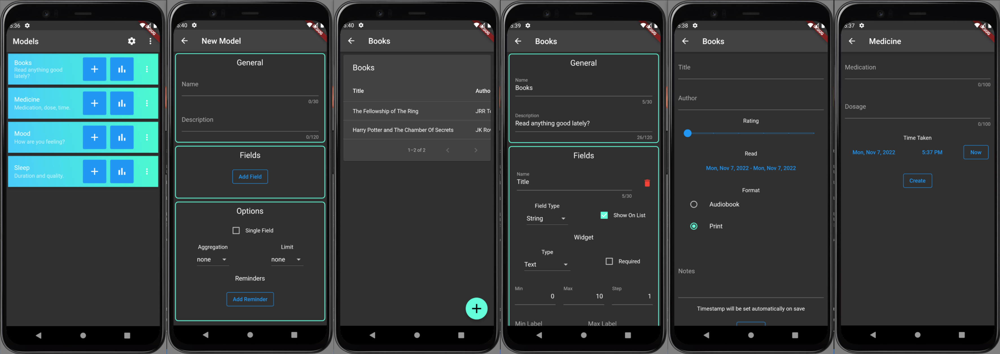

# Life Mining

### A flexible personal data tracking app that allows you to define your own trackable models. See [docs/models.md](./docs/models.md) for a details of how model schemas are defined.

## Features

- Dynamically defined model schemas.
- Models can be created with the GUI or with JSON.
- Data is stored locally in JSON files.
- Data access layer can easily be modified to use Firebase as a backend.

## Screenshots

